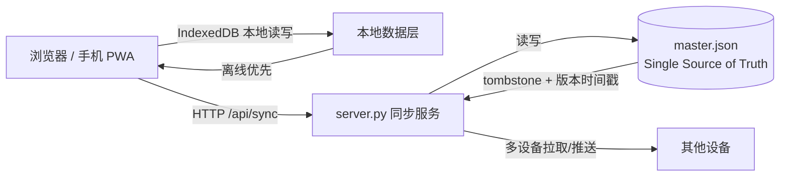

# 第二大脑工作台 · WorkBuddy

> 一个 **本地优先（local-first）** 的移动端个人知识管理与生产力工作台。纯前端 SPA + 轻量 Python 同步服务，数据存于浏览器 IndexedDB，支持多设备离线优先与云端互通。

---

## 一、这是什么

移动端优先的单页面（SPA）生产力工作台，收纳日程计划、随想、时间轴、AI 日报、饮品、记账、体重、习惯、金融、跳舞等个人生活与工作台账。

核心设计取向是 **local-first**：

- **离线优先**：所有数据存浏览器 IndexedDB，断网、关机也能用，不依赖任何远端数据库。
- **云端互通**：电脑上的 `server.py` 提供 `/api/sync` 端点，实现多设备数据合并同步。
- **PWA 离线壳层**：可安装到手机主屏幕，Service Worker 提供离线缓存。
- **双主题**：浅色 / 深色零延迟切换。

---

## 二、技术栈

| 层 | 技术 | 说明 |
|---|---|---|
| 前端 | 原生 JavaScript（ES Modules，无框架） | 模块化 `modules/*.js`，零构建依赖 |
| 样式 | 原生 CSS | 移动端优先，粉色少女配色体系 |
| 存储 | IndexedDB + localStorage 兜底 | 本地优先，离线可用 |
| 同步 | Python `server.py`（`/api/sync`） | 轻量后端代理，单文件 JSON 作为 Single Source of Truth |
| 离线 | Service Worker + Web App Manifest | PWA，可安装到主屏 |
| 图表 | Chart.js（`chart.min.js`） | 数据可视化 |

---

## 三、架构



**关键决策：本地优先，服务端只做"合并代理"**

- 每台设备本地都有完整数据副本（IndexedDB），主副本是电脑上的 `master.json`。
- 客户端把本地变更推给 `server.py`，服务端做**冲突合并**后回写 `master.json`。
- 不引入独立数据库（Postgres / Redis 等）——个人单机工具上属于过度工程，Single Source of Truth 用一个 JSON 文件足够。

---

## 四、数据同步机制（工程重点）

多设备同时改、网络抖动、设备离线后再上线，都会有**写入冲突**。本项目用两套机制解决：

1. **Tombstone（墓碑标记）**：删除不是真删，而是写一条 `{ deleted: true }` 的墓碑记录，合并时墓碑优先，避免"删除被旧副本复活"。
2. **版本时间戳合并**：每条记录带 `updatedAt`，合并时取时间戳较新的一方覆盖较旧的一方，保证最终一致。

> 这一点是真实踩坑后沉淀的：早期直接覆盖写入会导致"后同步的设备把先同步设备的修改冲掉"。改成墓碑 + 时间戳后，多端冲突不再丢数据。

---

## 五、开发方式

本项目采用 **AI 协作开发（vibe coding 思路）**：由人定方向、AI 写码、人验收。

但纯 vibe coding 容易"AI 乱写 → 翻车 → 推翻重做"。本项目为此自建了一套**工程护栏**：

- **Pre-mortem 门禁**：动手写码前先讲"这个功能会怎么坏"，过架构 / 数据 / 同步 / 部署维度。
- **领域建模先行**：改数据结构前先建模，不跳需求直接写码。
- **不迎合式推进**：先给反向检查、明确假设，不盲从"快做"。

> 简历视角：同样的"AI 对话写码"，本项目比纯 vibe 多了一层不翻车的保险——这是工程成熟度的体现。

---

## 六、快速开始

```bash
# 1. 启动本地服务（Windows）
python server.py
# 或 Linux / macOS
python3 server.py

# 2. 浏览器打开
# 本机：http://127.0.0.1:8080
# 手机（同 WiFi）：访问电脑局域网 IP :8080
```

**移动端使用**

1. 电脑启动服务，手机与电脑连同一 WiFi，访问局域网 IP；
2. 浏览器"添加到主屏幕"安装 PWA；
3. 电脑关机后，本地功能（计划 / 记账 / 舞蹈记录等）可离线使用；云端同步依赖电脑 `server.py` 运行。

---

## 七、业务模块清单

首页、随想、时间轴、AI 日报、饮品、记账、体重、习惯、计划、目标、工作、金融、跳舞。

> 模块随生活 / 工作需求持续迭代，变动时同步更新本清单。

### 随想自动化依赖

随想模块每日凌晨 01:00 由 WorkBuddy 自动化「随想日终整合」生成日终整合，工具入口 `tools/digest_tool.py`（fetch / pending / save 三个子命令），整合结果写入 `.sync/master.json`，沿局域网同步链路下发全部设备，并在 `data/thought-digests/` 留 Markdown 归档。整合不依赖 `server.py` 是否在运行，但**当天随想需先同步到电脑**才会被纳入分析。

---

## 八、工程约束规范（长期底线）

1. 全部工程文件统一存放工程根目录，`modules/` 原生模块规范不随意重构；导航侧边栏基础布局禁止大幅改动。
2. 老旧 `tasks.js` 任务模块已整合至 plans 计划模块，禁止恢复老旧代码。
3. 原生适配手机触屏交互，优先移动端布局，禁止优先改造大屏电脑样式。
4. 视觉标准：精致柔和审美，界面完整美观；粉色少女基础配色体系，保留原生弹窗、悬浮快捷按钮基础交互框架。
5. 交互标准：功能完整强大、操作便捷流畅；优先降低弹窗数量；录入流程轻量化。

---

## 九、已知现状

云端预览环境存在端口限制，不作为工程运行载体；全部开发调试统一在电脑本地文件夹环境开展。

## 十、迭代原则

工程持续跟随个人生活、工作需求优化，功能 / 页面布局按需调整；改造前优先对照开发约束规范。长期优化方向：离线运行稳定性、移动端交互体验、数据统计可视化。
